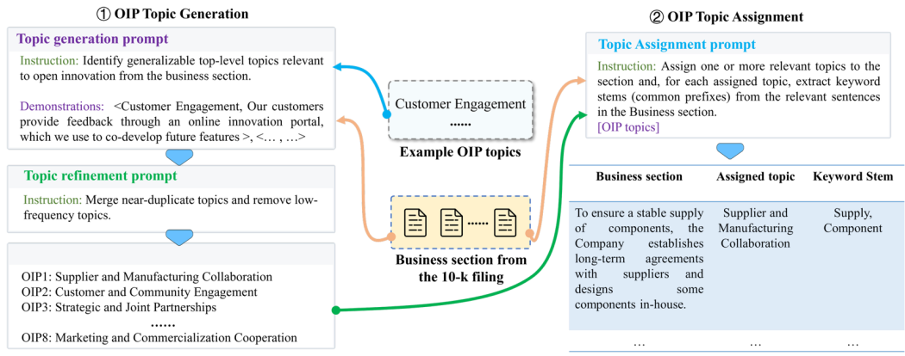

# Open Innovation Practices (OIP) Topic Modeling Research

## Abstract

This research project employs advanced topic modeling techniques using GPT to analyze open innovation practices (OIPs) in corporate 10-K filings. The study identifies, categorizes, and quantifies various forms of open innovation activities across different industry sectors, providing insights into how companies engage in external collaboration and innovation partnerships.

## Research Methodology

### 1. Topic Generation and Processing Pipeline

The research follows a systematic **topicGPT Process**:

1. **Raw Topic Generation**: Use GPT to identify open innovation-related topics from corporate documents
2. **Topic Merging**: Consolidate similar topics using GPT or sentence embedding technologies
3. **Keyword Selection**: Extract relevant keywords for each identified topic
4. **Topic Scoring**: Calculate topic scores based on keyword frequency relative to total word count
5. **Data Integration**: Combine topic scores with financial data and temporal information
6. **Regression Analysis**: Apply OLS regression to analyze the impact of OIP topics on financial performance

### 2. Identified Open Innovation Practice Categories

The research identifies eight primary categories of open innovation practices:

1. **Supplier and Manufacturing Collaboration**: Partnerships with suppliers and manufacturing entities
2. **Customer and Community Engagement**: Co-creation and collaboration with customers and communities
3. **Strategic and Joint Partnerships**: Strategic alliances and joint venture activities
4. **IP and Technology Licensing**: Intellectual property licensing and technology transfer
5. **Industry-Academia Collaboration**: University partnerships and research collaborations
6. **Technology and Platform Ecosystems**: Platform-based innovation and ecosystem development
7. **Open Innovation and Ecosystem Strategy**: Comprehensive open innovation strategies
8. **Marketing and Commercialization Cooperation**: Collaborative marketing and commercialization efforts

### 3. Data Sources and Processing

- **Primary Data**: SEC 10-K filings from publicly traded companies
- **Processing Pipeline**: Automated text analysis using GPT-based topic modeling
- **Sector Analysis**: Cross-industry analysis covering multiple GICS sectors
- **Temporal Analysis**: Multi-year analysis with lagged financial indicators

## Technical Implementation

### Core Components

- **`oip_topicGPT/`**: Main processing pipeline
  - `v1_generation_raw.py`: Initial topic generation
  - `v3_assignment.py`: Topic assignment and keyword extraction
  - `v4_statistic.py`: Statistical analysis and scoring
  - `v5_to_form.py`: Data formatting and preparation
  - `v6_regression.py`: Regression analysis
  - `util.py`: Utility functions and API client

- **`oip_prompt/`**: GPT prompt templates
  - `v1_generation_raw.txt`: Topic generation prompts
  - `v3_assignment.txt`: Topic assignment prompts
  - `seed_topics.txt`: Initial topic seeds

### Configuration and Data

- **`config.yml`**: Project configuration settings
- **`data/input/`**: Raw 10-K filings and metadata
- **`data/output/`**: Processed topics, keywords, and analysis results
- **`data/paper/`**: Final research outputs and sector distributions

## Research Contributions

1. **Methodological Innovation**: Novel application of GPT for systematic OIP identification
2. **Comprehensive Taxonomy**: Detailed categorization of open innovation practices
3. **Empirical Analysis**: Large-scale analysis across multiple industries and time periods
4. **Financial Impact Assessment**: Quantitative analysis of OIP effects on corporate performance

## Usage and Replication

### Prerequisites
- Python 3.x environment
- GPT API access (configurable in `util.py`)
- Required dependencies (see project files)

### Running the Analysis
1. Configure API settings in `util.py`
2. Prepare input data in `data/input/`
3. Run the processing pipeline sequentially (v1 → v3 → v4 → v5 → v6)
4. Results will be generated in `data/output/` and `data/paper/`

### Customization
- Modify topic seeds in `oip_prompt/seed_topics.txt`
- Adjust prompts in `oip_prompt/` directory
- Configure analysis parameters in `config.yml`
- Customize regression variables in `v6_regression.py`
